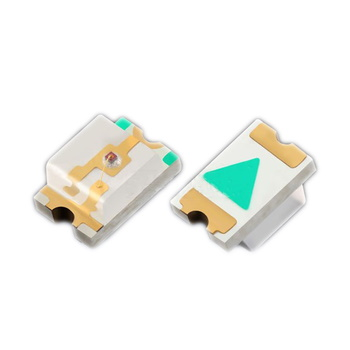
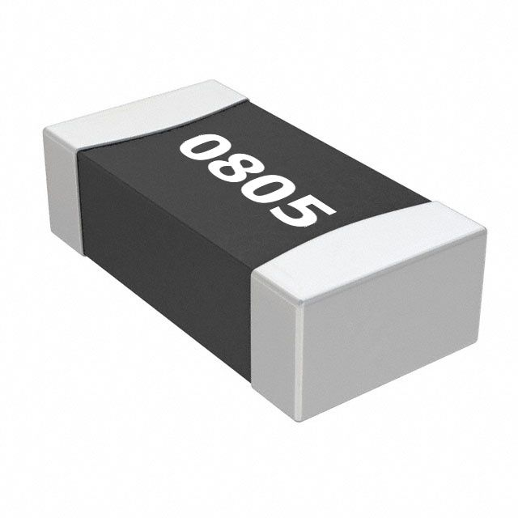

# 2d-xmas-Tree-art
A DIY flat christmas decoration with a ATtiny25, 20 led´s and a coin cell battery 

## New Features
- Converted to [PlatformIo](https://platformio.org/) project
- Uploading firmware and setting fuses get easier
- Added animation compressing script
- Significantly reduced memory footprint
- More default animations
- Reduced power consumption

## Overview

This is the only 2-dimensional pcb with all the components embedded into the 1,6mm thick pcb itself.
The components are placed with the help of castellation into the pcb. 

## PCB

The PCB design is made with KiCad 5.0.1

The PCB should be 1,6mm thick to hide the components inside. Last time I ordered them from [DirtyPCbs](https://dirtypcbs.com/) as suggesed by [@designer2k2](https://github.com/designer2k2). They handle castellation, but you still need to clean metal contacts from bended metalization debris. Next time I'm going to order with [JLCPCB](https://jlcpcb.com/) as I like their bright solder mask color more. To order PCB, use prepared gerber archive [2D_xmas_tree01_gerber_complete.zip](https://raw.githubusercontent.com/kasedy/2d-xmas-tree-art/master/pcb-kicad/gerb/2D_xmas_tree01_gerber_complete.zip)

Most of the PCB is to give it the look of a tree or house, it uses the different color achievable by blending the different layers. Here is a good article on possible colors: https://hackaday.com/2018/06/11/ask-hackaday-what-color-are-your-pcbs/

## Partlist

|ID|#|Ref|Value|Footprint|RS|Digikey|Aliexpress|Img|
| --- | --- | --- | --- | --- | --- | --- | --- | --- |
|BT|2|BT1-BT2|Battery Cell|CR2016|-|-|[CR2016](https://www.aliexpress.com/item/32865072812.html)||
|C|1|C1|22µF|0805|790-0682|1276-6786-1-ND|[0805 22uF capacitor](https://www.aliexpress.com/item/32374775517.html)||
|D|20|D1-D20|LED|0805|176-6117|516-1431-1-ND|[0805 LED](https://www.aliexpress.com/item/1206476683.html)||
|R|5|R1-R5|see table below|0805|-|RR12Q75DCT-ND|[0805 Resistor](https://www.aliexpress.com/item/32865947306.html)||
|R|1|R6|10k|0805|125-1189|RR12P10.0KDCT-ND|[0805 Resistor](https://www.aliexpress.com/item/32865947306.html)||
|SW|1|SW1|SW_SPDT|PCM12SMTR|793-1721|401-2016-1-ND|[MSK-12C02](https://www.aliexpress.com/item/32863424888.html)||
|U|1|U1|ATTINY25-20SU|SOIC8|133-1611|ATTINY25-20SU-ND|-||

ATiny-45 and ATiny-85 will work as well as ATtiny-25 but ATtiny-25 is cheaper and has enough memory to fit the sketch.

## LED

You are free to use any other LED apart proposed above. Please select R1-R5 resistors value according to the table. The lower resistor value the brighter will be LEDs but battery life also will get shorter.

| Nice   look | Color | Vmin | Vmax | Non-compensated mode (Ohm)   Min - Recomended - Max | Compensated mode (Ohm)   Min - Max |
| :---: | :---: | :---: | :---: | :---: | :---: |
| :x: | Red | 1.70 | 2.00 | 150 - 330 - 680 | 30 - 50 |
| :heavy_check_mark: | Yellow | 1.80 | 2.05 | 125 - 160 - 250 | 30 - 50 |
| | Orange | 1.80 | 2.05 | 125 - 160 - 250 | 30 - 50 |
| :x: | Green | 2.10 | 3.30 | 330 - 680 - 1800 | 30 - 75 |
| :heavy_check_mark: | White | 2.40 | 3.10 | 100 - 470 - 680 | 15 - 60 |
| :heavy_check_mark: | Blue | 2.40 | 3.25 | 100 - 330 - 1000 | 8 - 100 |

In a compensated mode LEDs will have the same brightness regardless how many LEDs are shining. Every enabled LED will shine no more than 1/20 of animation frame time. Resistors should give up to 10-15 mA through a single LED. In non-compensated mode the animation frame with a single LED on will look brighter than an animation with multiple LEDs on. Resistors should give up to 2-4 mA current through a single LED. Non-compensated brightness mode is a default as it gives almost the same brightness for animation frames with high number LEDs enabled, but frames with low number active LEDs look much brighter for the same current consumption from a battery. To change the mode update value of COMPENSATED_BRIGHTNESS flag.

## Assembly

Assembly might be a little challenging. The full process can be seen in this [youtube video](https://www.youtube.com/watch?v=K6z7--RqQHQ). I'll mention here only the tricky parts.

Solder the LED oriented with the cathode to the line, like it's shown on the picture. If you by some reason soldered LEDs upside down and animation looks weird, set REVERSED_LEDS flag to "true" when compile the firmware.

The ATtiny feet needs to be trimmed very closely to the body to fit it inside the cutout.

Use very thin wire to create a kind of spider web for the battery, but don't shortcut it!

Then use some tape to secure it in place.

## Upload Firmware

- Install [PlatformIo](https://platformio.org/)
- Download and open the project at "firmware" directory
- Connect ISP programmer head
- Run "Set Fuses" and "Upload" under "attiny25_1MHz" build rule

To program ATtiny microcontroller ISP programmer is needed. For example an open-source [USB ASP](https://www.fischl.de/usbasp/). As an alternative some Arduinos can be converted to a ISP programmer with ArduinoISP https://www.arduino.cc/en/Tutorial/ArduinoISP.

ISP Pinout:

## Create your own animation!

Use [graphical interface](https://kasedy.github.io/2d-xmas-tree-art/) to create unique animation. Copy every frame value into [animation.txt](firmware/src/animation.txt). After animation is ready compile and upload the firmware.

